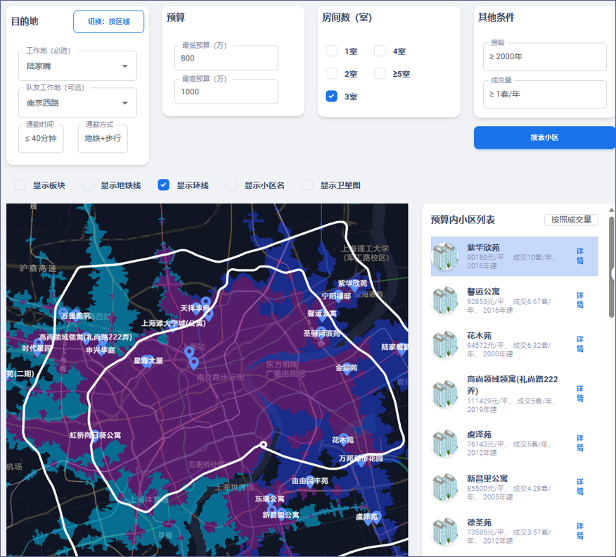
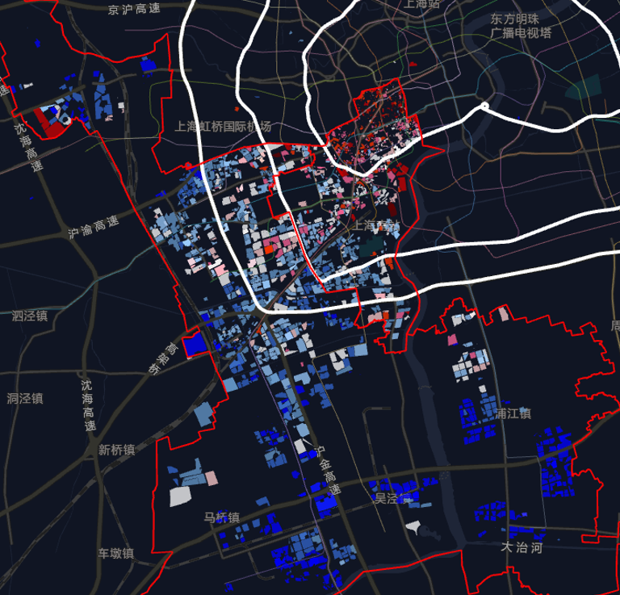
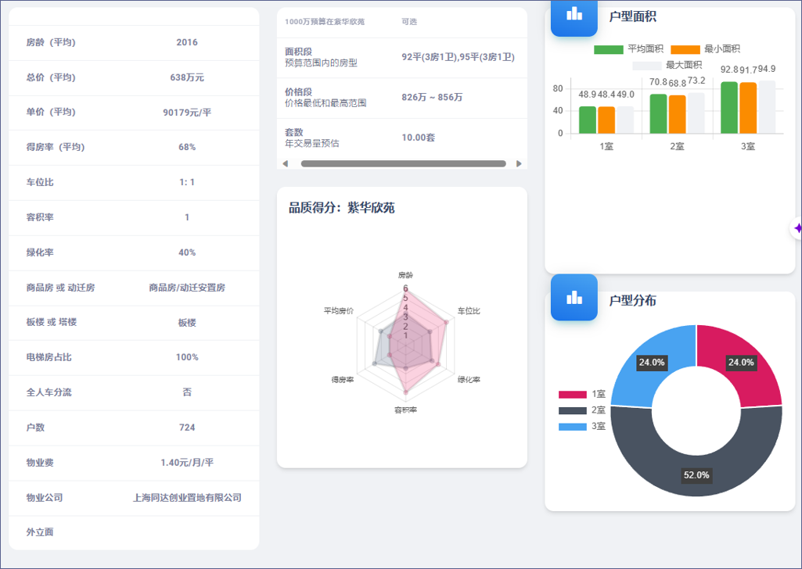
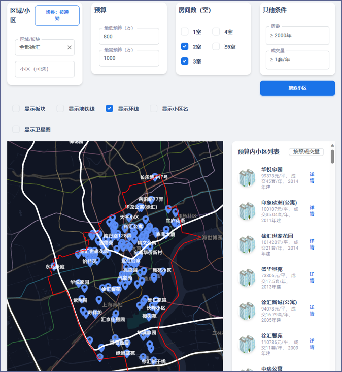
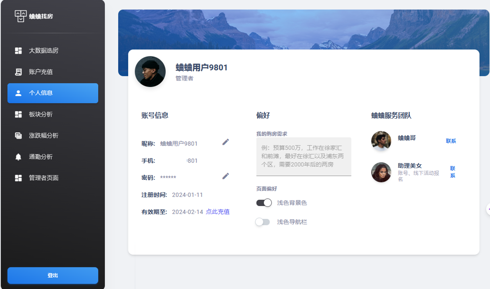

# 蛐蛐找房：大数据的精准小区选房平台 | QuquHousing: Big Data-Driven Precision Housing Platform

综合用户预算、通勤地址、房龄、房型、通勤时间等要求，通过大数据智能选择具体小区以及具体户型的网站服务。
基于Lianjia_Spider项目的数据开发，前端用户页面基于https://www.creative-tim.com/learning-lab/react/box/material-dashboard/ 项目优化。

A web service that uses big data to intelligently select specific housing compounds and unit types based on user requirements including budget, commute address, property age, layout, and commute time.
Developed using data from the Lianjia_Spider project, with the frontend user interface optimized based on the https://www.creative-tim.com/learning-lab/react/box/material-dashboard/ project.

## 前端产品功能 | Frontend Features

1. 根据通勤时间等时圈搜索房源 | Search properties based on commute time isochrones 
2. 整体区域的房源及单价可视化 | Visualization of property distribution and prices by district 
3. 小区详情分析 | Housing compound detailed analysis 
4. 房源大数据搜索 | Big data property search 
5. 上海地铁通勤分析 | Shanghai metro commute analysis 

## 后台产品功能 | Backend Features

1. Javascript实现微信个人收款码，赞赏码支付 | JavaScript implementation of WeChat personal payment and appreciation code payments
2. 账号管理页面，支持不同等级会员管理 | Account management page supporting different membership levels 

## 项目结构 | Project Structure

本项目由两个主要组件组成：
- **QuquHousing-client**: 前端React应用
- **QuquHousing-server**: 后端Node.js服务器

This project consists of two main components:
- **QuquHousing-client**: Frontend React application
- **QuquHousing-server**: Backend Node.js server

## 安装说明 | Setup Instructions

### 前提条件 | Prerequisites
- Node.js和npm | Node.js and npm
- MySQL服务器 | MySQL server

### 服务器设置 | Server Setup
1. 导航至服务器目录 | Navigate to the server directory:
   ```
   cd QuquHousing-server
   ```

2. 安装依赖 | Install dependencies:
   ```
   npm install
   ```

3. 基于`.env.example`模板创建`.env`文件 | Create a `.env` file based on the `.env.example` template:
   ```
   cp .env.example .env
   ```

4. 在`.env`文件中配置您的环境变量 | Configure your environment variables in the `.env` file with your own values:
   - JWT密钥 | JWT secrets
   - 数据库凭证 | Database credentials
   - 短信服务凭证 | SMS service credentials
   - 阿里云凭证 | Alibaba Cloud credentials

5. 启动服务器 | Start the server:
   ```
   npm start
   ```

### 客户端设置 | Client Setup
1. 导航至客户端目录 | Navigate to the client directory:
   ```
   cd QuquHousing-client
   ```

2. 安装依赖 | Install dependencies:
   ```
   npm install
   ```

3. 启动客户端应用程序 | Start the client application:
   ```
   npm start
   ```

## 环境配置 | Environment Configuration

应用程序使用环境变量进行配置。敏感信息如API密钥、数据库凭证和JWT密钥存储在`.env`文件中，这些文件不会提交到存储库。

The application uses environment variables for configuration. Sensitive information such as API keys, database credentials, and JWT secrets are stored in `.env` files which are not committed to the repository.

### 所需环境变量 | Required Environment Variables

#### 服务器 | Server
- `ACCESS_TOKEN_SECRET`: JWT访问令牌的密钥 | Secret key for JWT access tokens
- `REFRESH_TOKEN_SECRET`: JWT刷新令牌的密钥 | Secret key for JWT refresh tokens
- `ALIBABA_CLOUD_ACCESS_KEY_ID`: 阿里云访问密钥ID | Alibaba Cloud access key ID
- `ALIBABA_CLOUD_ACCESS_KEY_SECRET`: 阿里云访问密钥密钥 | Alibaba Cloud access key secret
- `SHENZHI_SMS_APPCODE`: 短信服务应用代码 | SMS service app code
- `SMS_SIGN_NAME`: 短信签名名称 | SMS signature name
- `SMS_TEMPLATE_CODE`: 短信模板代码 | SMS template code
- `DB_HOST`: 数据库主机 | Database host
- `DB_USER`: 数据库用户名 | Database username
- `DB_PASSWORD`: 数据库密码 | Database password
- `DB_NAME`: 数据库名称 | Database name
- `DB_PORT`: 数据库端口 | Database port
- `NODE_ENV`: 环境（开发/生产）| Environment (development/production)

## 安全说明 | Security Notes

- 切勿将`.env`文件或任何包含密钥的文件提交到存储库 | Never commit `.env` files or any files containing secrets to the repository
- 数据库凭证应只对授权管理员可访问 | Database credentials should only be accessible to authorized administrators
- JWT密钥应为强随机字符串 | JWT secrets should be strong random strings 